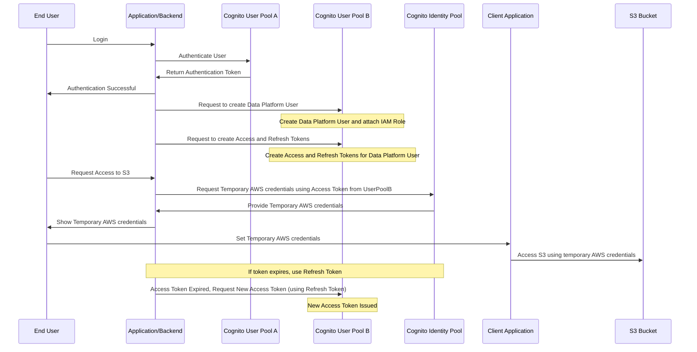

自社が持つS3バケットとクライアントを接続させたい場合はあるのではないでしょうか。しかしながら、S3バケットへのアクセスはバケット情報を慎重に管理しなければ、バケット内部のファイルが第三者へと流出してしまう懸念があります。

今回はそのようなバケット内部のファイルが流出してしまわぬように、Cognitoを通してセキュアにアクセスさせる方法を勉強したので、そのまとめをしたいと思います。

## 想定する状況

まずは想定する状況をまとめておきます。基本的にApplication/Backendはサーバーサイドで、Client Applicationが顧客が持つ何かしらのアプリケーションだと想像していただければと思います。例えば、サーバーアプリケーションで生成されたIoTデータや顧客単位ログ情報や広告アクセスログをS3上にアップロードし、顧客自身のアプリがそのデータをS3まで閲覧しに行くといったユースケースを想定しています。サーバーで生成した価値ある情報を顧客にセキュアにシェアしたい要望を実装します。

### Application/Backend
- ログイン認証にCognitoを使用
- Cognitoユーザープール作成済み
- S3バケットにデータを定期的に出力している
- S3バケットをClient Applicationにセキュアに公開したい
- 顧客（Client Applicationを持つ方）はこちらのApplicationのエンドユーザー
- S3バケットはApplication

### Client Application
- 顧客側が持つアプリケーション
- 顧客がもつアプリなので変更不可
- Application/Backendが持つS3に接続しにいきたいが認証をセキュアに行いたい

今回のユースケースでは、サーバーサイドの持つログイン認証基盤であるAWS Cognitoを利用して、エンドユーザーにClient Application接続用のユーザーをユーザープールより払い出します。払い出されたユーザーにはアクセストークンとリフレッシュトークンを付与しておき、エンドユーザーのS3バケットへのリクエストに応じて、IDプールから接続用のクレデンシャルを払い出す仕組みを提案します。具体的なダイアグラムフローを次の項目で示していきます。

## 提案するアーキテクチャ概念図
まず先にアーキテクチャの概念図を示そうと思います。

認証の流れをざっくり解説すると以下です。

1. **ログイン**
   - エンドユーザーはアプリケーションにログインします。

2. **ユーザー認証**
   - アプリケーションは、Cognito User Pool Aにユーザーを認証するようリクエストします。

3. **認証トークンの取得**
   - User Pool Aは認証トークンをアプリケーションに返します。
   - アプリケーションは、認証が成功したことをエンドユーザーに通知します。

4. **クライアント用ユーザーの作成**
   - アプリケーションは、User Pool Bにクライアント用ユーザーを作成するリクエストを送ります。User Pool Bは、クライアント用ユーザーを作成し、IAMロールを付与します。

5. **アクセスとリフレッシュトークンの作成**
   - アプリケーションは、User Pool Bにアクセストークンとリフレッシュトークンを作成するリクエストを送ります。

6. **S3へのアクセスリクエスト**
   - エンドユーザーは、S3へのアクセスをリクエストします。
   - アプリケーションは、User Pool Bから受け取ったアクセストークンを使用して、Cognito Identity Poolに一時的なAWS認証情報をリクエストします。

7. **一時的なAWS認証情報の提供**
   - Identity Poolは、一時的なAWS認証情報をアプリケーションに提供します。
   - アプリケーションは、これらの認証情報をエンドユーザーに表示します。

8. **クライアントでの認証情報の設定**
   - エンドユーザーは、クライアントに一時的なAWS認証情報を設定します。

9. **S3へのアクセス**
   - クライアントアプリケーションは、一時的なAWS認証情報を使用してS3にアクセスします。

10. **トークンの有効期限切れ時の処理**
    - もしトークンが有効期限切れの場合、アプリケーションはリフレッシュトークンを使用して、User Pool Bから新しいアクセストークンをリクエストします。

ポイントとしては、いくつかあります。
1~4までは一般的なcognitoによるアプリケーションへのログインを示しています。
5.のIAMロールのアタッチのところでS3バケットへのアクセス権を持ったロールを付与します。このロールにはアクセスコントロールポリシーの属性を使用し。IDPoolのロールマッピング設定で、ユーザー属性に基づいて異なるIAMロールを割り当てることができ、ユーザーが認証に成功すると、Cognito User PoolからIDトークンが発行され、そのIDトークン内のクレームがIDPoolで評価されます。この評価に基づいて、ユーザーに対応するIAMロールが動的に割り当てられるのです。

ユーザープールをAとBで分割している理由としては、エンドユーザーのアプリケーションへのサインインとクライアントアプリケーション認証どちらか片方の認証に失敗したときに両方とも凍結されてしまうリスクがあり、ユーザープールの同一ユーザーで両方を認証するのはリスクが大きいためです。

https://docs.aws.amazon.com/ja_jp/cognito/latest/developerguide/iam-roles.html

## アクセスコントロールポリシーへの属性
前項にて、ユーザーに認証情報を渡したいIAM ロールを準備する必要がある旨を述べましたが、アクセスコントロールに属性を使用するには、データソースとして設定したクレームによって、選択したタグキーの値が設定される必要があります。

クレームとは、**ユーザーの識別情報や属性を示す情報**のことを指します。例えば、ユーザーがログインした後、Identity Provider (IDP)からトークンが発行されます。このトークン内には、ユーザーに関する情報（例：ユーザーID、名前、権限レベル、所属部署など）がクレームとして格納されており、これを基にシステムはユーザーのアクセス権限を管理します。

これにより、ユーザーのセッションは、特定のタグキーと値でタグ付けされ、これを基にアクセス制御の評価が行われます。適切なタグが付けられたセッションは、IAMポリシーで定義されたアクセス権限に従ってS3バケットにアクセスできます。

IAMポリシーでは、**${aws:PrincipalTag/tagkey}** 条件を使用してユーザーのアクセスを評価します。IAMは、これらのタグの値をポリシーに照らして評価します。

権限の付与では、**AssumeRoleWithWebIdentity**アクションを使用して、ロールの引き受ける権限を付与します。sts:TagSession 権限を使用して、ユーザーのセッションにタグを付ける権限を付与します。

https://docs.aws.amazon.com/ja_jp/cognito/latest/developerguide/using-afac-with-cognito-identity-pools.html

## IDプールが発行する一時的なAWSクレデンシャル
IDプールは一時的なAWSリソース（例えばS3, DynamoDBなど）に対するアクセス権限を払い出す事ができます。一時的なAWSクレデンシャルは、AWSのAccess Key ID、Secret Access Key、およびSession Tokenの三つの要素から構成されます。またクレデンシャルにはある一定の有効期限があります。今回のユースケースに当てはめてみると、クライアントアプリケーションはこの３つの要素をもとにクライアントアプリケーションとS3バケットへの認証を試みます。

IDプールが発行する一時的なAWSクレデンシャルには２つの認証フローが存在します。
**拡張 (簡略化) 認証フロー**
GetCredentialsForIdentity API を使用します。この場合、取得される一時的な認証情報の有効期限は1時間で固定となり、こちらの設定は変更不可。

*ID プール (フェデレーティッドアイデンティティ) の認証フロー・拡張 (簡略化) 認証フローより引用*

アプリは最初にAmazon Cognito ユーザープールやサードパーティーIDプロバイダーからのIDトークンを用いてGetIDリクエストを行います。得られたアイデンティティIDは、GetCredentialsForIdentityリクエストで使用され、簡易化された認証情報取得を可能にします。このフローでは、バックグラウンドでのGetOpenIdTokenとAssumeRoleWithWebIdentityの実行が自動化され、ユーザーがAWSリソースに1時間アクセスできる認証情報が提供されます。主要なステップとしては、GetIdとGetCredentialsForIdentityが挙げられます。

**基本 (Classic) 認証フロー**
AssumeRoleWithWebIdentity API を使用します。これによりアプリケーションの権限が拡張され、十分な信頼ポリシーが設定された任意の AWS Identity and Access Management ロールへの認証情報をリクエストできるようになります。
この場合、パラメーターとして DurationSeconds を指定することで、最大12時間までの有効期限の設定が可能です。

*ID プール (フェデレーティッドアイデンティティ) の認証フロー・基本 (Classic) 認証フローより引用*

アプリケーションは、Amazon Cognito ユーザープールやサードパーティーIDプロバイダーからのIDトークンを提供し、アイデンティティIDを取得します。このIDは、新しいOAuth 2.0トークンを取得するために使われます。その後、この新しいトークンでAWS API認証情報を取得します。このフローは、細かい認証制御とカスタムセッション期間の要求に適しています。主要なステップにはGetId、GetOpenIdToken、AssumeRoleWithWebIdentityが含まれます。

https://docs.aws.amazon.com/ja_jp/cognito/latest/developerguide/authentication-flow.html

## 自動再認証のロジック
自動再認証のロジックには「更新トークン」を使用します。この更新トークンは、最初の認証時にアクセストークンと一緒に提供され、アクセストークンが期限切れになる前に新しいアクセストークンを取得するために使用されます。更新トークンの有効期限は1〜3650（日）の任意の値を指定できますので、アクセストークンの実質的な有効期限をコントローラブルにすることが可能です。ロジック自体は、Application/Backend側に組み込むAWS SDKなどで実装可能です。

参考
https://dev.classmethod.jp/articles/study-tokens-of-cognito-user-pools/#toc-4

## 悩みどころ
cognitoでクライアントアプリケーションのログインを実現できるのは良いものの、IDプールが発行する一時的なAWSクレデンシャルではクライアントアプリケーションの認証し直しが定期的に発生します。自社のクライアントアプリケーションにジョブスケジューラでログデータなどを取得し続けたいといったユースケースを満たすことはできません。半永久的な認証をIDプールから発行できればよいのですが、cognitoではそれができません。これらを解決するためにはバケットにアクセス権を持つIAMユーザーを作成し、それに長期のAWSクレデンシャルを割り当てキーローテーションすることは、一時的なクレデンシャルよりも簡便かつやりたい仕様が実現可能です。しかし認証をcognitoにまとめて認証の責務をcognitoに一任するほうが設計が複雑化しないメリットがあります。これらは自社のユースケースでどちらかを選べばよいか変わってくるポイントとなりそうです。

## まとめ
Cognitoを利用したクライアントアプリケーションとS3バケットの認証は効率的かつ安全に行うことができます。しかしながら一時的なAWSクレデンシャルの発行で顧客のユースケースを満たせるかは慎重な見極めが必要です。